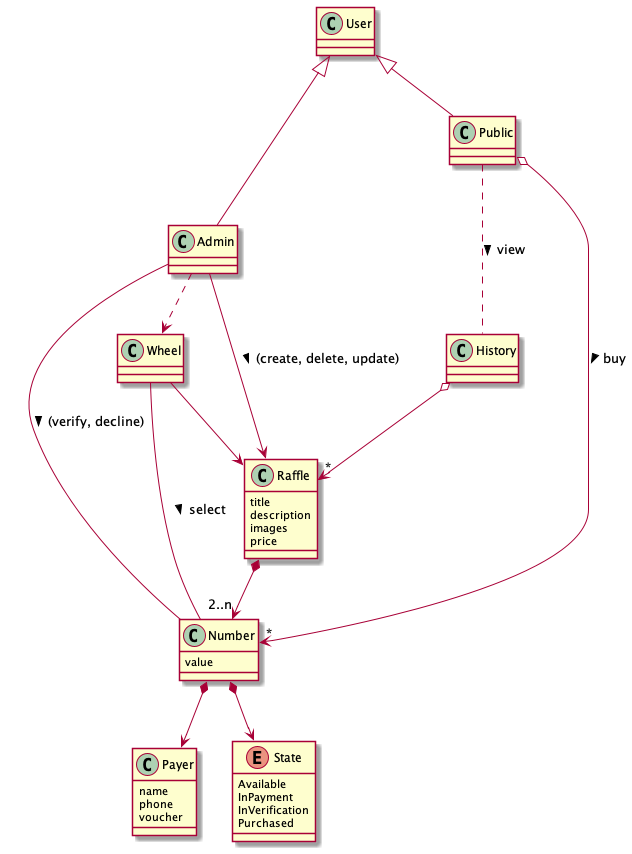
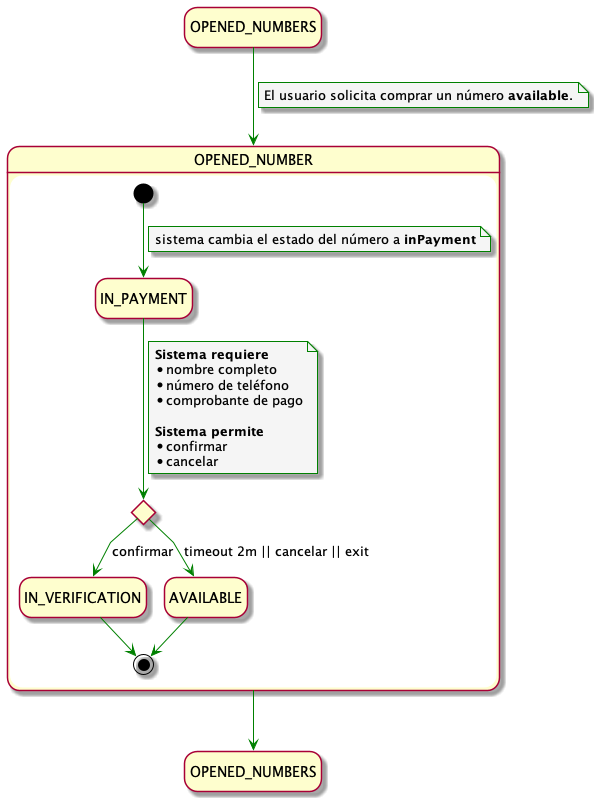
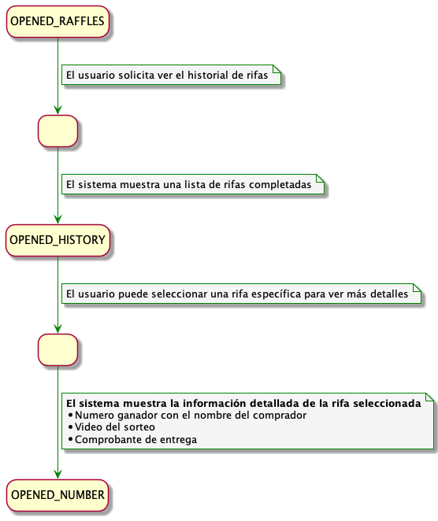

# Sistema de Gestión de Rifas

## Presentación General

El sistema tendrá como objetivo facilitar la gestión de rifas y la participación de usuarios en sorteos de manera sencilla y estructurada.

## Metas

### 1. Meta General

Facilitar la gestión de rifas y la participación de usuarios de manera estructurada, sencilla, segura y transparente, garantizando una experiencia positiva para los usuarios públicos y administradores.

### 2. Metas Específicas

#### Para el Usuario Público:

- **Acceso Fácil y Rápido**: Permitir la visualización y participación en rifas activas de manera intuitiva desde cualquier dispositivo.
- **Transparencia**: Asegurar que los procesos de pago, asignación de números y selección de ganadores sean visibles y confiables.
- **Actualizaciones en Tiempo Real**: Mantener informados a los usuarios sobre el estado de sus números mediante notificaciones oportunas.
- **Historial Informativo**: Proveer un historial claro de rifas pasadas, grabación del sorteo y su ganador.
- **Transparencia en la Elección**: Ofrecer mecanismos para que los participantes puedan ver y confiar en el proceso de selección del ganador.

#### Para el Administrador:

- **Control Centralizado**: Facilitar la gestión integral de las rifas, desde su creación hasta la selección de ganadores.
- **Verificación Eficiente**: Agilizar el proceso de revisión de pagos mediante herramientas automatizadas y una interfaz clara.
- **Confianza en los Resultados**: Garantizar la imparcialidad en la selección de ganadores mediante la ruleta virtual.

## Funciones del Sistema (El sistema deberá...)

### 1. Usuario Público

- **Visualización de Rifas Activas**:

  - **Mostrar el listado de rifas activas:**

    - El título
    - La descripción
    - Imágenes
    - Precio
    - Cantidad de números apartados y disponibles

- **Gestión de Números**:

  - **Mostrar el listado de números de una rifa con su respectivo estado**
  - **Actualizar en tiempo real el estado de los números**
  - **Permitir filtrar por estado o valor**

- **Proceso de Compra**:

  - **Permitir comprar un número disponible ingresando:**

    - El nombre completo
    - Número de teléfono
    - Comprobante del pago

    El proceso de pago tendrá una duración de 2 minutos o si sale de la vista del formulario, de no ser completado el número volverá a estar disponible.

- **Historial**:

  - **Mostrar historial de rifas completadas:**
    - Resaltando el número ganador (color o etiqueta)
    - Con el respectivo video del sorteo
    - Con el comprobante de entrega

### 2. Administrador

- **Autenticación**:

  - **Autenticar administradores**

- **Gestión de Rifas**:

  - **Permitir crear rifas**
  - **Permitir actualizar rifas:**
    - No se puede modificar la cantidad de números
    - No se puede actualizar el precio de una rifa con números comprados
  - **Permitir eliminar rifas:**
    - No se puede eliminar una rifa con números comprados

- **Gestión de Números**:

  - **Filtrar números por estado o valor**
  - **Permitir verificar el pago de un número mediante la consulta del comprobante**
  - **Permitir declinar un número en proceso de pago o verificación**
  - **Permitir consultar la información de un número en verificación o comprado**

- **Selección de Ganador**:

  - **Seleccionar ganador mediante una ruleta virtual cuando todos los números estén apartados**
    - Grabar el sorteo y mostrar el nombre del ganador
    - La ruleta mostrará el número y el nombre del comprador
    - La rifa estará completada y pasará a mostrarse en el historial con su respectiva grabación del sorteo y posteriormente el comprobante de entrega

- **Notificaciones**:
  - **Enviar notificaciones al usuario (Mediante WhatsApp)**
    - Cuando un pago es verificado o declinado
    - Cuando se selecciona un ganador, notificar el resultado a todos los usuarios públicos
    - Enviar el enlace del historial donde el sistema mostrará el video del sorteo

## Flujo de Usuario

### 1. Usuario Público

1. Accede a la aplicación
2. Visualiza la lista de rifas activas
3. Selecciona un número disponible para apartar
4. Ingresa los datos requeridos (nombre, teléfono, captura de pago)
5. El número cambia al estado "En proceso de pago"
6. Espera la verificación del administrador
7. Al confirmar el pago, el número se marca como "Apartado", se le notificará al comprador y su nombre aparecerá junto al número

### 2. Administrador

1. Inicia sesión en el panel de administración
2. Visualiza las rifas activas y filtra los números en proceso de pago
3. Verifica los pagos revisando los comprobantes
4. Cambia el estado de los pagos a "Apartado" cuando son confirmados, en caso contrario vuelve a estar disponible
5. Agrega nuevas rifas al sistema si es necesario
6. Una vez todos los números de una rifa estén comprados, utiliza la ruleta virtual para seleccionar al ganador
7. Una vez entregado el premio al ganador, se sube el comprobante de entrega en el historial de la rifa

## Glosario

**Aplicación de Rifas**: Plataforma digital diseñada para gestionar rifas, permitiendo la participación de usuarios y la administración de sorteos.

**Administrador**: Rol con privilegios para gestionar rifas, verificar pagos, y seleccionar ganadores mediante una ruleta virtual.

**Usuario Público**: Participante de la rifa que puede visualizar rifas activas, apartar números, consultar su estado, y revisar el historial de rifas.

**Apartar un Número**: Proceso mediante el cual un usuario reserva un número disponible, proporcionando su información personal y un comprobante de pago.

**Autenticación**: Sistema de seguridad que requiere el inicio de sesión para acceder a ciertas funcionalidades administrativa.

**Estado de los Números**: Condición actual de un número en una rifa, que puede ser:

- **Disponible**: Número libre para ser apartado.
- **En proceso de pago**: Número reservado con pago pendiente de verificación.
- **En proceso de verificación**: Pago enviado, pero aún en revisión.
- **Apartado**: Pago confirmado, número asignado al usuario.

**Historial de Rifas**: Obtener información sobre las rifas que ya se han completado.

**Notificaciones en Tiempo Real**: Alertas automáticas enviadas a los usuarios o administradores para informar sobre cambios en el estado de los números o procesos.

**Número Ganador**: Número seleccionado aleatoriamente mediante la ruleta virtual, cuyo propietario es el ganador de la rifa.

**Pantalla de Gestión de Rifas**: Interfaz administrativa que permite gestionar rifas activas, verificar pagos, y seleccionar números ganadores.

**Pantalla Principal de Rifas Actuales**: Sección visible para los usuarios públicos donde se muestran rifas activas, sus descripciones e imágenes representativas.

**Ruleta Virtual**: Herramienta digital utilizada para seleccionar de forma aleatoria al ganador de una rifa, mostrando un proceso transparente y visualmente atractivo.

**Transparencia para los Participantes**: Práctica de mostrar públicamente el proceso de selección de ganadores para generar confianza en los usuarios.

**Verificación de Pagos**: Proceso mediante el cual el administrador valida la autenticidad de los pagos realizados por los usuarios para cambiar el estado de los números reservados.

**Rifa comprada**: Una rifa comprada será aquella que tenga todos sus números comprados.

**Rifa completada**: Una rifa completada será rifa comprada con un ganador seleccionado.

**Grabación del sorteo**: Registro visual del momento en que se lleva a cabo el sorteo de la rifa para seleccionar el ganador.

**Comprobante de entrega**: Registro visual del momento en que se entrega el premio al ganador.

## Modelo de Dominio



_El diagrama del modelo de dominio muestra las entidades principales del sistema de rifas y sus relaciones._

## Casos de Uso

### Diagrama General de Casos de Uso


_Diagrama general que muestra todos los casos de uso del sistema y los actores involucrados._

### Casos de Uso del Administrador

#### Gestión de Rifas

**Crear Rifa**


**Actualizar Rifa**


**Eliminar Rifa**


#### Gestión de Números

**Declinar Pago**


**Verificar Pago**


#### Selección de Ganador

**Seleccionar Ganador con Ruleta Virtual**


**Subir Comprobante de Entrega**


### Casos de Uso del Usuario Público

**Comprar Número**



**Ver Historial de Rifas**



### Casos de Uso Compartidos

**Filtrar Números**


_Este caso de uso está disponible tanto para administradores como para usuarios públicos con diferentes niveles de acceso._

---

## Desarrollo

### Ejecutar el servidor de desarrollo

```sh
npm run start
```

### Crear un build de producción

```sh
npm run build
```

---
